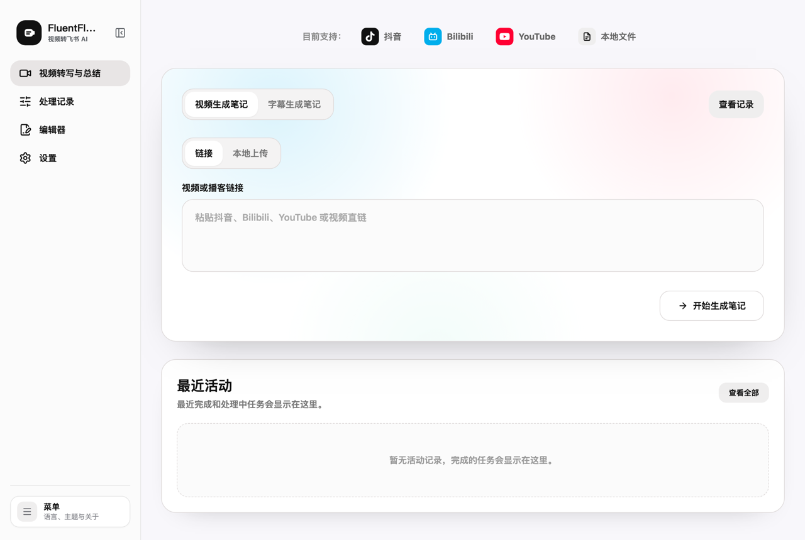
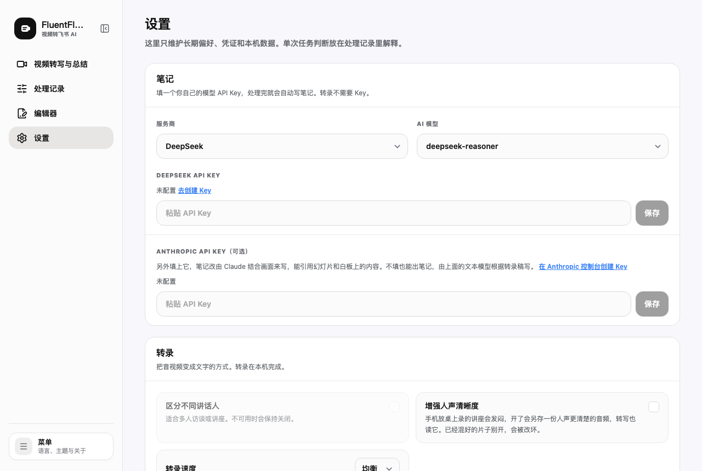

# FluentFlow Local

本地运行的视频/音频转录与笔记工具。贴一条抖音、Bilibili、YouTube 链接，或者选一个本机
文件，它把音视频转成文字，再写成一份可以编辑和导出的笔记。转录在本机完成，不上传；笔记
生成和飞书导出只会连接你自行配置的服务。



转录用的是本机的 Whisper 模型，Apple 芯片走 GPU 加速。讲话人区分、人声增强、转录速度都
在设置里，处理过程中的判断会写进每个任务的记录，而不是藏在日志里。



## 能在什么机器上跑

- **macOS**：Apple 芯片（M 系列）转录走 GPU 加速。Intel Mac 也能装，转录走 CPU，会慢不少。
  需要先装好 [Homebrew](https://brew.sh)，其余依赖安装脚本会自己补。
- **Windows 10 / 11**：有 NVIDIA 显卡时走 GPU，没有就走 CPU。系统自带的 winget 会被用来补
  Python、Node.js 和 FFmpeg。

磁盘预留约 8 GB，明细见下文「需要多少磁盘空间」。

## 安装

先把代码拿到本地。装了 git 的话：

```bash
git clone https://github.com/Userneima/fluentflow-local.git
cd fluentflow-local
```

没装 git 也可以：到 [Releases](https://github.com/Userneima/fluentflow-local/releases) 页面下载
最新版本的 Source code (zip)，解压后在终端里进入解压出来的文件夹。在一台全新的 Mac 上第一次
运行 `git`，系统会弹窗要求安装命令行开发者工具，点「安装」等它装完再重跑即可。

### macOS

```bash
bash launchers/macos/setup-local.sh
```

它会建虚拟环境、装 Python 和前端依赖、构建前端、下载转录模型，最后在桌面生成
「FluentFlow Local.app」。装完双击桌面图标即可使用，不需要再开终端。

整个过程不需要你回答任何问题。FFmpeg 和 Node.js 缺失时会用 Homebrew 直接装上；
Homebrew 本身需要你自己先装（https://brew.sh），那一步要输密码。`--skip-desktop`
不生成桌面图标，`--skip-model` 不下转录模型（留到第一次转录时再下）。

### Windows

```powershell
powershell -NoProfile -ExecutionPolicy Bypass -File .\launchers\windows\setup-local.ps1
```

同样是一次装完，同样不问问题。Python、Node.js、FFmpeg 缺失时会用 winget 直接装上。
检测到 NVIDIA 显卡时，它会把 CUDA 12 与 cuDNN 9 运行库装进这个虚拟环境；不需要装机器级
CUDA Toolkit，但显卡驱动要在。`-SkipModel` 不下转录模型。装完双击桌面上的
「FluentFlow Local」启动。

如果脚本装完 Python 或 Node.js 后提示找不到它们，关掉这个 PowerShell 窗口，开一个新的再运行一次。

已经装好、只想补 GPU 运行库：

```powershell
.\.venv\Scripts\python.exe -m pip install -r requirements-windows-gpu.txt
```

有显卡时转录用 large-v3，没有时自动降到 medium。运行库缺失会退回 CPU，并在启动
检查里说明缺什么。

### 手动安装

```bash
python3 -m venv .venv
.venv/bin/pip install -r requirements-local.txt
npm install
npm run build:frontend
.venv/bin/python scripts/stt_model.py fetch
.venv/bin/python -m uvicorn backend.local_main:app --host 127.0.0.1 --port 8000
```

需要 Python 3.10 以上和 FFmpeg。AI 与飞书凭据在应用的设置页里填写。运行数据默认
保存在系统应用数据目录（macOS 是 `~/Library/Application Support/FluentFlow`），
不在仓库中。

## 第一次使用

1. 双击桌面上的「FluentFlow Local」。它在后台启动服务，然后在浏览器里打开
   `http://127.0.0.1:8000`。关掉浏览器标签不会停掉服务，再双击一次图标就回到页面。
2. 打开左侧「设置」，在最上面的「笔记」一栏填一个模型 API Key，默认是 DeepSeek（下一节说明
   去哪申请）。首页顶部有黄色提示条时，说明还没有可用的 Key。
3. 回到首页，贴一条视频链接，或者切到「本地上传」选一个文件，点「开始生成笔记」。
4. 处理完的任务在「处理记录」里，点进去可以改转录稿、改笔记、导出 Markdown，或者发到飞书。

抖音、Bilibili 高清、YouTube 受限视频要登录才能下载。在「设置 → 转录 → 视频链接下载登录态」
里选你平时登录这些网站的浏览器，它会在本机读取那个浏览器的登录状态，不上传。

## 笔记要接你自己的模型账号

转录在本机跑，不需要任何账号，也不花钱。笔记要调用模型，用的是你自己的 API Key，费用由你的
模型账号直接付，不经过我们。Key 都填在「设置 → 笔记」：

- **文本模型（必填其一）**：默认 DeepSeek，Key 在
  [DeepSeek 开放平台](https://platform.deepseek.com/api_keys) 创建；也可以换成 OpenAI 或
  通义千问。填好后每个任务处理完都会根据转录稿写一份笔记。
- **Anthropic API Key（可选）**：另外填上它，笔记改由 Claude 结合视频画面来写，能引用幻灯片和
  白板上的内容。Key 在 [Anthropic 控制台](https://console.anthropic.com/settings/keys) 创建。
- 一个 Key 都没有，你会拿到转录稿、字幕和剪好的音视频，但没有笔记。

Key 保存在本机的应用数据目录里，填完立即生效，不必重启。更多可配置项（端口、数据目录、
下载源等）在 `distribution/local.env.example` 里有说明，复制成仓库根目录的 `.env` 再改。

## 导出到飞书

在「设置 → 导出」里选导出方式：

- **本机身份导出**：装好飞书官方命令行工具 `lark-cli` 并登录，笔记会以你本人的身份写进
  「我的文档库」，不需要建应用。
- **飞书应用导出**：在[飞书开放平台](https://open.feishu.cn/app)建一个企业自建应用，开通云文档
  的创建与编辑权限，把 App ID 和 App Secret 填进「设置 → 高级 · 其他凭证」。缺哪项权限，
  导出失败时的提示会写出权限名。

## 让 Claude Code、Codex 等 AI 工具调用它

FluentFlow Local 自带一个 MCP 服务（让 AI 工具直接调用本应用的标准接口），AI 工具可以替你
提交视频、等待结果、读取笔记。这个接口默认关闭：

1. 在仓库根目录的 `.env` 里加一行 `FLUENTFLOW_ACCESS_TOKEN=`，后面接一串你自己定的随机字符，
   然后重启 FluentFlow Local。
2. 在应用左下角「菜单 → Agent 接入」里填入同一串字符，页面会生成可以直接复制的 Claude Code
   和 Codex 配置。

## 更新到新版本

```bash
cd fluentflow-local
git pull
bash launchers/macos/setup-local.sh
```

Windows 同样是 `git pull` 后重新运行 `setup-local.ps1`。安装脚本可以重复运行，会按新版本
重装依赖、重建界面；任务记录和填过的 Key 不在代码目录里，不受影响。用 zip 安装的，下载新版本解压后
在新文件夹里运行安装脚本即可。

## 出问题时

先跑一遍启动前检查，它会逐项说明缺什么、转录会走哪条路：

```bash
.venv/bin/python scripts/check_local_readiness.py
```

Windows 上是 `.venv\Scripts\python.exe scripts\check_local_readiness.py`。

服务日志在 `~/Library/Logs/FluentFlow/local.log`（Windows 是
`%LOCALAPPDATA%\FluentFlow\Logs\local.log`）。单个任务里每一步的判断写在该任务的处理记录里。
还解决不了，到 [Issues](https://github.com/Userneima/fluentflow-local/issues) 提问，附上检查
结果和日志末尾几十行；不要附 API Key、`.env` 或你的媒体文件。

## 需要多少磁盘空间

在一台 Apple Silicon Mac 上实测：

| | 占用 |
| --- | --- |
| Python 依赖（`.venv`） | 1.7 GB |
| 前端依赖与构建产物 | 0.2 GB |
| 转录模型 large-v3 | 3.1 GB |

产品自己占约 5 GB。加上系统层的 Xcode 命令行工具、Homebrew、FFmpeg 和 Node.js
（这台机器上量到约 2.8 GB），一台全新的 Mac 从零到跑完第一个任务约 8 GB。之后每个
任务还会在应用数据目录里留下媒体、抽帧和中间产物，那部分随使用增长，没有上限。

只用 CPU 转录的机器会自动改用 medium（约 1.5 GB），不会下载跑不动的那个模型。

模型从 Hugging Face 下载。那里连不上时安装脚本会自动改用镜像 `hf-mirror.com`，也可以
用 `HF_ENDPOINT` 指定自己的源，或者给 `scripts/stt_model.py fetch` 加 `--mirror`。

## 卸载

```bash
bash launchers/macos/uninstall-local.sh            # 只卸程序
bash launchers/macos/uninstall-local.sh --models   # 连转录模型一起
bash launchers/macos/uninstall-local.sh --data     # 连任务数据一起
bash launchers/macos/uninstall-local.sh --all --dry-run   # 先看看要删什么
```

Windows 用 `launchers\windows\uninstall-local.ps1`，开关是 `-Models`、`-Data`、
`-All`、`-DryRun`。

默认只删虚拟环境、前端依赖、桌面启动器和日志，这些重装就回来。转录模型和任务
数据各自需要显式开口：模型住在 Hugging Face 的公共缓存里，脚本只删本产品下载过
的那几个目录；任务数据删掉无法恢复，所以会再确认一次。

FFmpeg、Node.js、Homebrew 和 Python 不会被动，它们是系统工具。代码目录留给你自己
删——卸载脚本就在里面。

## Development

这是本地版的独立开发仓库，功能、构建、测试、启动器和文档都在这里维护。与 FluentFlow Hosted
的边界和跨仓库移植规则见 `docs/edition_boundaries.md`。

```bash
npm run lint:frontend
npm run build:frontend
npm run test:frontend
.venv/bin/python -m pytest tests/ -q
```

`npm run build:frontend` 生成本地版由 `backend.local_main` 提供的 `frontend/dist-local`。
不要提交该构建目录、`.env`、媒体、任务数据库或导出内容。

启动前的环境检查可以单独跑，它会说明转录会走哪条路、模型在不在本机：

```bash
.venv/bin/python scripts/check_local_readiness.py
```

## License

FluentFlow Local 使用 GNU Affero General Public License v3.0 或更高版本（AGPL-3.0-or-later）。如果你修改本项目并将其作为网络服务提供，AGPL 可能要求向该服务用户提供相应源代码；这不是法律意见，请阅读仓库中的 `LICENSE` 并自行取得法律建议。
